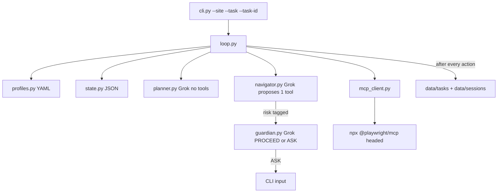

# Chameleon: packaging-ready build plan

The spec’s flat `/agent.py` layout is fine for a 130-minute hack and wrong for a repo you will later `pip install` or containerize. This plan **decides the final tree now**, writes **[docs/requirements.md](docs/requirements.md)** as the contract, then builds the live demo against that tree.

Repo today: empty except [README.md](README.md), [LICENSE](LICENSE), [agent-build-spec.md](agent-build-spec.md). Keep the spec as the contest prompt; do not treat it as the installable layout.

## Final folder structure

```
chameleon/
├── README.md
├── LICENSE
├── agent-build-spec.md
├── pyproject.toml              # package + console script + deps
├── .env.example                # XAI_API_KEY=
├── .gitignore                  # extend: data/, .env
│
├── docs/
│   └── requirements.md         # product + engineering contract (written first)
│
├── src/chameleon/
│   ├── __init__.py
│   ├── __main__.py             # python -m chameleon
│   ├── cli.py                  # argparse; entry point `chameleon`
│   ├── loop.py                 # orchestrator (plan → nav → guardian → persist)
│   ├── llm.py                  # xai_sdk wrapper; no MCP
│   ├── mcp_client.py           # Playwright MCP stdio wrapper
│   ├── state.py                # JSON save/load + schema
│   ├── profiles.py             # load YAML site profiles
│   ├── narration.py            # colored agent handoff logs
│   └── agents/
│       ├── planner.py          # no MCP import
│       ├── navigator.py        # only agent that proposes MCP tools
│       └── guardian.py         # no MCP import
│
├── configs/sites/
│   ├── saucedemo.yaml
│   └── greenhouse.yaml
│
├── data/                       # gitignored runtime
│   ├── tasks/{task_id}.json
│   └── sessions/{task_id}/     # user-data-dir + storage_state.json
│
├── tests/
│   ├── test_state.py
│   ├── test_profiles.py
│   └── test_agent_isolation.py
│
└── scripts/
    └── smoke_mcp.py            # phase 1: manual MCP calls, no agents
```

**Not created in this build:** `Dockerfile`, `docker-compose.yml`, web UI. Reserve the layout so they drop in later without moving Python.

### Why this layout (packaging + later containers)

- **`src/chameleon/`** — installable package. `pip install -e .` / `uv sync` today; `COPY src pyproject.toml` tomorrow. Console script `chameleon` from `[project.scripts]`, so Docker `ENTRYPOINT` does not depend on a root `agent.py`.
- **`configs/sites/*.yaml`** — site knowledge is data, not `if site ==`. Add a site without a code change; in Docker, bind-mount `configs/` to swap profiles without rebuilding.
- **`data/` outside the package** — task JSON + Playwright profile. In Docker this is a named volume. Never bake cookies into the image.
- **`mcp_client.py` is the only I/O seam** — local demo spawns `npx @playwright/mcp@latest` over stdio. Later a container can point the same client at `http://playwright-mcp:8931/mcp` (Playwright MCP HTTP transport) with no agent changes.
- **Planner/Guardian cannot import MCP** — enforced by a unit test that greps those modules. Matches spec: Navigator is the only agent with browser tools. The **loop** executes the proposed tool and always calls `browser_storage_state` after each action (orchestrator persistence, not an LLM tool).



---

## What [docs/requirements.md](docs/requirements.md) will contain

Write this file **before code**. It is the acceptance contract; the spec is the contest prompt. Outline:

**1. Problem** — Browser agents succeed or fail silently. Chameleon pauses on genuine ambiguity or irreversible steps, and resumes from disk after a kill with no re-login and no re-deciding.

**2. Goals** — Live headed demo on two site profiles (`saucedemo`, `greenhouse`); three Grok 4.6 agents; state after every action; kill/resume; modular profiles.

**3. Non-goals (this build)** — Stealth/anti-bot; generic multi-site crawler; Docker/K8s; web UI / CDP screencast; dynamic Planner (stretch only).

**4. Functional requirements**

- FR1 CLI: `chameleon --site <id> --task "<nl>" --task-id <id>` (also `python -m chameleon`).
- FR2 Profiles: YAML under `configs/sites/`; agents 100% profile-agnostic.
- FR3 Planner: checklist from `checklist_template` (hardcoded this build). Optional later: one Grok call.
- FR4 Navigator: one Grok call per turn; input `{sub_goal, snapshot, history, guardian_answers}`; output exactly one of `browser_navigate` / `browser_click` / `browser_type` / `browser_snapshot`. Does not execute; returns a proposal.
- FR5 Guardian: invoked only when sub-goal `risk != none`. Output `PROCEED` or `ASK(question)`. ASK blocks on `input()`, persists answer, resumes Navigator with that answer.
- FR6 State: write JSON after every executed action and after every Guardian answer. Schema:

```
site, task, planner_checklist, current_subgoal_index,
navigator_action_history, guardian_answers, current_url,
storage_state_path, status  # running | paused_ask | completed | failed
```

- FR7 Resume: if `data/tasks/{task_id}.json` exists, do **not** re-run Planner or login. Spawn MCP with `--user-data-dir data/sessions/{task_id}`, restore via `browser_set_storage_state` if a dump exists, `browser_navigate` to saved `current_url`, continue at `current_subgoal_index`.
- FR8 Narration: print which agent is acting and why (handoff visible next to the browser). Color in stretch.

**5. Non-functional**

- NFR1 Browser headed (`headless` never set). No stealth plugins.
- NFR2 Grok 4.6 via `xai_sdk` (`XAI_API_KEY`); real reasoning at each decision — no hardcoded click sequences.
- NFR3 Navigator-only MCP: `planner.py` and `guardian.py` must not import `mcp_client` or MCP.
- NFR4 Secrets: `.env` gitignored; Sauce Demo creds live in YAML for the public demo site only.

**6. Site profiles (data contract)**

`saucedemo`: login `standard_user` / `secret_sauce`, shopping checklist from the spec.

`greenhouse`: `requires_login: false`, form-fill checklist from the spec. Pick one live public Greenhouse `#app` URL at scaffold time (placeholder in YAML until chosen).

Risk tags: `none` | `ambiguous_choice` | `needs_user_info` | `irreversible`.

**7. Demo acceptance (must pass twice)**

1. `--site saucedemo --task "buy me a t-shirt" --task-id demo1` — Guardian asks which shirt; user answers; checkout asks zip; finish.
2. Kill (Ctrl+C) on a second run right after a Guardian question; restart same `--task-id`; resumes without re-login or re-asking answered questions.
3. `--site greenhouse --task "apply to this job for me" --task-id demo-gh` — same agents, different YAML, no code branch.

**8. Later (explicitly out of this build)**

- `deploy/Dockerfile`: Python 3.11 + Node 20 image; `ENTRYPOINT ["chameleon"]`; volume `/data`; MCP via HTTP sidecar or in-process stdio.
- Headed-in-Docker: Xvfb + noVNC (or MCP `--port` + VNC). Do not start this until the Mac headed demo is solid.
- Stretch web UI from spec §7.

---

## Tooling and deps (in `pyproject.toml`)

- Python `>=3.11`
- Runtime: `xai-sdk`, `mcp`, `pyyaml`, `python-dotenv`, `pydantic` (state + profile schema)
- Dev: `pytest`
- Console script: `chameleon = chameleon.cli:main`
- System: Node 18+ (`npx @playwright/mcp@latest`), Chromium via Playwright MCP first run
- Env: `XAI_API_KEY`

No `requirements.txt` unless you want a lock dump; `pyproject.toml` is the source of truth for packaging.

---

## Step-by-step build (after you approve this plan)

### Step 0 — Docs + scaffold (do first)

1. Write [docs/requirements.md](docs/requirements.md) from the outline above.
2. Create the tree, `pyproject.toml`, `.env.example`, extend `.gitignore` (`data/`, `.env`).
3. Expand [README.md](README.md) with install + run commands only.
4. YAML profiles for both sites (Greenhouse URL: a live public job `#app` page).

### Step 1 — Playwright MCP smoke (~20 min)

`scripts/smoke_mcp.py`: spawn MCP headed, `browser_navigate` Sauce Demo, `browser_snapshot`, `browser_click` / `browser_type` login. Stop until this works. No agents yet.

MCP spawn args for the real client later: no `--headless`; `--user-data-dir` per task; `--window-size` / `--window-position` when we get to stretch.

### Step 2 — State + profiles (~15 min)

Pydantic models in `state.py` / `profiles.py`. Atomic JSON writes to `data/tasks/{task_id}.json`. Tests: round-trip save/load; unknown `--site` fails cleanly.

### Step 3 — Planner (~10 min)

`planner_plan(task, profile) -> checklist` copies `checklist_template`. One print of the ordered sub-goals. Skip Grok unless stretch.

### Step 4 — LLM + Navigator (~35 min)

`llm.py`: `Client(api_key=...)`, `chat.create(model="grok-4.6")`, parse JSON action `{tool, arguments, reason}`.

`navigator_step(...)` — Grok only; allowlist the four tools. `loop.py` executes via `mcp_client.call_tool`, snapshots, appends history, **always** `browser_storage_state` → `data/sessions/{task_id}/storage_state.json`, then `save_state()`.

### Step 5 — Guardian (~25 min)

Only if `risk != none`. Parse `PROCEED` | `ASK`. On ASK: `status=paused_ask`, save, `input()`, store answer, resume Navigator with answers in context. Irreversible steps must ASK before confirm/submit.

### Step 6 — Resume + SIGINT (~20 min)

On launch, load existing task file. Skip Planner. Restore session + URL. Continue index. SIGINT: persist `status=paused_ask` or `running` then exit.

### Step 7 — Rehearse (must pass twice)

Sauce Demo end-to-end. Kill/resume. Greenhouse same binary.

### Step 8 — Buffer + isolation test

`tests/test_agent_isolation.py`: planner/guardian source must not mention `mcp`. Fix whatever rehearsal broke.

### Stretch (only after step 7 twice)

Color-coded narration; window position; dynamic Planner. Web UI is a separate project.

---

## Key implementation rules (from spec, enforced in code)

- Grok decides clicks; no scripted Sauce Demo paths.
- Guardian is the product: “knows when NOT to act alone.”
- Persistence is after **every** action, not only pauses.
- `storage_state` dump is orchestrator-owned (`browser_storage_state` / `browser_set_storage_state`); the LLM never gets those tools.
